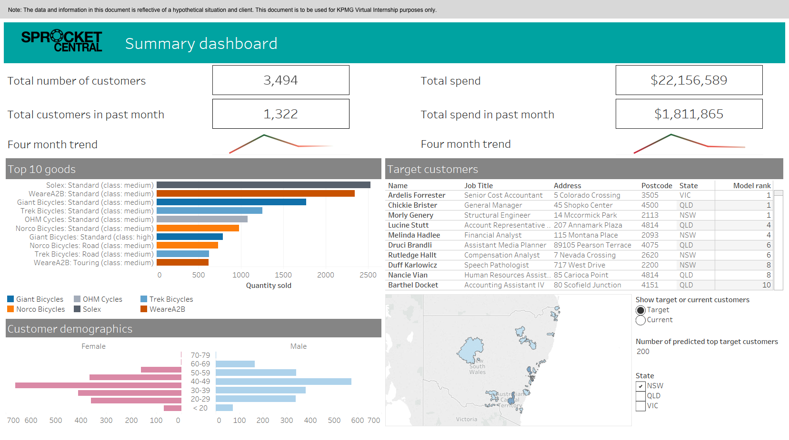

# yuvrajsinghbhadoria_portfolio

# [Project 1: EDA_on_indian_cars](https://github.com/yuvrajsinghbhadoria/EDA_on_indian_cars)

this is a project I did for my Major project of my B.tech degree, where i build different graphs as per user requirements.

* data was taken from the kaggle dataset.
* The project uses EDA(Exploratory Data Analysis) to know the best company cars for indian driving conditions.
* Tech used - numpy, pandas, seaborn,matploytlib,scipy,plotly,jupyter notebook.
* plot - scatter plot, bar graph, pie graph,pair plot,sub plot.
* Get to know that about 90% indian population still depend on gasoline and diesel engine vehicle . 

## Overview of pair plot of dispalcement,Ex_showroom_price and fuel type  ## overview of scatter plot of displacement and price  ## overview of Scatter plot 3d plot  ## overview of cars count by engine fuel tank 

# [Project 2: Sales_insight_Tableau](https://github.com/yuvrajsinghbhadoria/sales_insight_using_tabeau)

this was part of personal project where I get data from open source in SQL to perform ETL(Extract,transform, Load) and data cleaning . 
In tableau enact data cleaning , data munging , currency normalization and handling invalid values .
Form a dashboard in Tableau which will analyse the annual product category wise sales analysis to help client to
identifying the sales region and sales manager performance . From this sales dashboard company able to save 40 % of there precious time .

Tech used - SQL,tableau 
# dashboard of different sales 

# [Project 3 :Covid19_data_analysis ](https://github.com/yuvrajsinghbhadoria/covid_19-data-analysis)

this was part of personal project where I get data from the ministry of health and family welfare portal . In the project perfom EDA(Exploratory Data Analysis)
to get to know most active case of india , most death , most confirmed case , highest vaccinated and least vaccinated states.
Tech uesd - numpy, pandas, seaborn,matploytlib,scipy,plotly,jupyter notebook.
here i also do data cleaning , data munging , fillna .
Also find mortality rate , recovery rate ,sorting .

## top affected states  ## top and least vaccinated states  ## death

# [Internship Project : KPMG_Virtual_data_analyst_internship](https://github.com/yuvrajsinghbhadoria/KPMG_virtual_data_analyst_internship)

this was part of my internship project where i do Data Exploration, Model Development , Interpretation .
i do data cleaning like remove duplicate value , remove unwanted item , remove blank box . 
Here do customer Analysis like Age distributions, Number of bike purchases in 3 years / percentages purchases, Job industry category,Wealth segments ,Number of cars own on each states .
from this analysis we interpretate like our new customers are on Finance industry and our Manufacturing ,Affluent Customers but mostly second and third quadrant,our new customers mostly Female with 50.6% purchases with total of 25,212 bikes Male contributed to 47.7% purchases with 23,765 bikes So we should focus on advertises on Female customers than Male customers , mostly our new customers are between 25 to 48 years old.
Number of customers from 48 to 59 years old has big drops on percentages. There is a slightly increase in number of customers over 59 years old in term of percentages It looks like the percentages of under 25 years old not really change

##  summary dashboard  ## clustering  # ordering 

